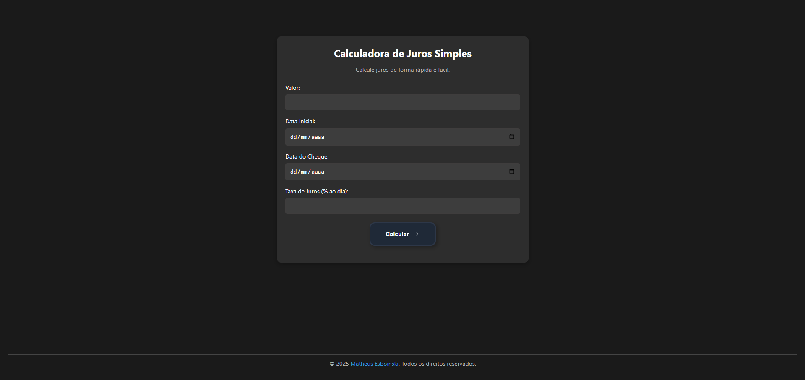
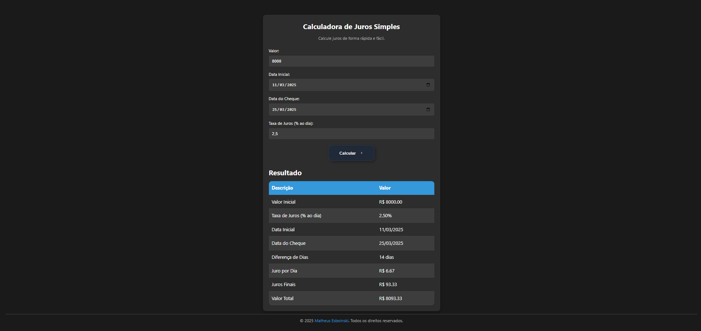
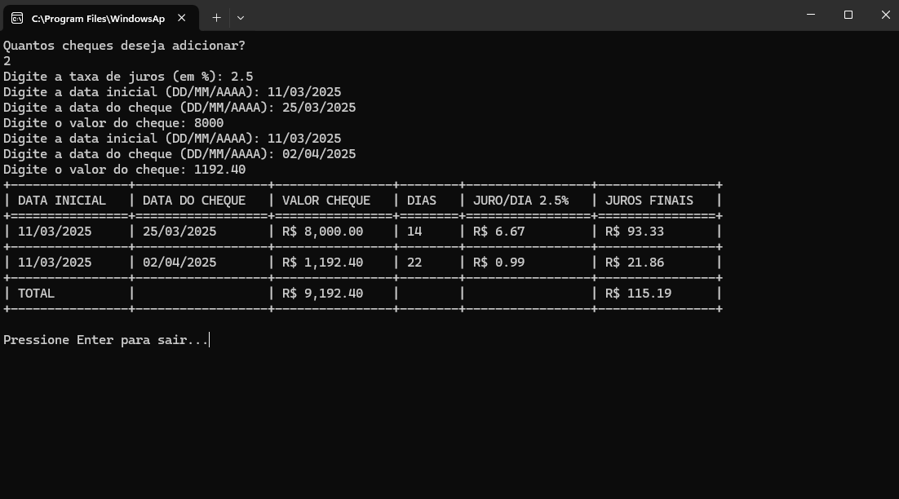

# Calculadora de Juros Simples
Calculadora para calcular juros simples com base em um valor inicial, taxa diária de juros e o período entre duas datas. Suporta tanto uma interface web quanto um script Python para cálculos automáticos.


## Catálogo

- [Funcionalidades](#funcionalidades)
- [Galeria](#galeria)
- [Compatibilidade](#compatibilidade)
- [Como usar](#como-usar)
  - [Versão Web (frontend)](#versão-web-frontend)
  - [Versão CMD (backend)](#versão-cmd-backend)
     - [Exemplo de execução do script Python](#4-exemplo-de-execucao-do-script-python)
- [Desinstalação](#desinstalação)
- [Dependências](#dependências)


## Funcionalidades
* Calcula juros simples baseados em valor inicial, taxa diária e período de tempo.
* Suporta diferentes taxas de juros, personalizáveis pelo usuário.
* Interface interativa e intuitiva.
* Cálculos automáticos de juros simples, tanto na versão web quanto através de script Python.
* Totalmente funcional tanto na versão web quanto no script Python.
* O script Python exibe os resultados em uma tabela simples utilizando a biblioteca `tabulate`, proporcionando uma visão clara e organizada dos cálculos.
* A versão web exibe os resultados em uma tabela estilizada, proporcionando uma interface mais interativa e visualmente agradável para o usuário.
* O script Python permite adicionar múltiplos cheques de uma vez, facilitando o cálculo de juros para diferentes períodos ou valores.

## Galeria

<details><summary><b>Web</b></summary>
   

*Interface inicial da versão web, onde o usuário insere os dados para cálculo.*


*Tela de resultados da versão web, exibindo os cálculos em uma tabela estilizada.*
</details>

<details><summary><b>CMD</b></summary>
   

*Resultados exibidos no terminal, utilizando a biblioteca `tabulate` para formatação.*
</details>


## Compatibilidade  
### Web  
- Compatível com os principais navegadores modernos: **Google Chrome, Mozilla Firefox, Microsoft Edge e Safari**.  
- Funciona em **Windows, macOS e Linux**, desde que haja um navegador compatível.  
- Não requer instalações adicionais, basta acessar a versão online.  

### CMD (Python) 
- Compatível com **Python 3.x**.  
- Testado em **Windows, macOS e distribuições Linux**.  
- Requer a biblioteca `tabulate` para exibição dos resultados em formato de tabela.
- Pode ser executado em **ambientes locais ou servidores** para cálculos automatizados.

## Como usar

### Instalação e Execução

#### Versão Web (frontend)

1. Acesse a versão online do sistema de cálculo de juros no navegador através do [link do sistema](https://calculadora-de-juros-simples.vercel.app/).
2. Insira os valores necessários nos campos indicados.
3. Clique em "Calcular" para visualizar os resultados em uma tabela estilizada.
---
#### Versão CMD (backend)
1. Certifique-se de ter o **Python 3.x** instalado no seu sistema.  
2. Baixe o script Python a partir da [página do repositório](https://github.com/esboinski/calculadora-de-juros-simples/tree/main/backend).  
3. Se desejar usar a exibição formatada com `tabulate`, instale a biblioteca executando:  
```bash
pip install tabulate
````
<a id="4-exemplo-de-execucao-do-script-python"></a>4. Exemplo de execução do script Python

```python
Quantos cheques deseja adicionar? 
2 
Digite a taxa de juros (em %): 
2.5 
Digite a data inicial (DD/MM/AAAA): 
11/03/2025 
Digite a data do cheque (DD/MM/AAAA): 
25/03/2025 
Digite o valor do cheque: 
8000 
Digite a data inicial (DD/MM/AAAA): 
11/03/2025 
Digite a data do cheque (DD/MM/AAAA): 
02/04/2025 
Digite o valor do cheque: 
1192.40

Resultado:
+----------------+------------------+----------------+--------+-----------------+----------------+
| DATA INICIAL   | DATA DO CHEQUE   | VALOR CHEQUE   | DIAS   | JURO/DIA 2.5%   | JUROS FINAIS   |
+================+==================+================+========+=================+================+
| 11/03/2025     | 25/03/2025       | R$ 8,000.00    | 14     | R$ 6.67         | R$ 93.33       |
+----------------+------------------+----------------+--------+-----------------+----------------+
| 11/03/2025     | 02/04/2025       | R$ 1,192.40    | 22     | R$ 0.99         | R$ 21.86       |
+----------------+------------------+----------------+--------+-----------------+----------------+
| TOTAL          |                  | R$ 9,192.40    |        |                 | R$ 115.19      |
+----------------+------------------+----------------+--------+-----------------+----------------+
````
### Desinstalação
- Para a versão web, basta sair da página.  
- Para o script Python, basta excluir o arquivo baixado.

## Dependências

* [Tabulate](https://pypi.org/project/tabulate/) - Biblioteca Python para exibição de tabelas no terminal.
* [Python 3.x](https://www.python.org/downloads/) - Requer Python 3.x instalado em seu sistema para execução.
* `datetime` - Biblioteca nativa do Python para manipulação de datas e horários. **Não é necessário instalar**, pois já vem com o Python.
